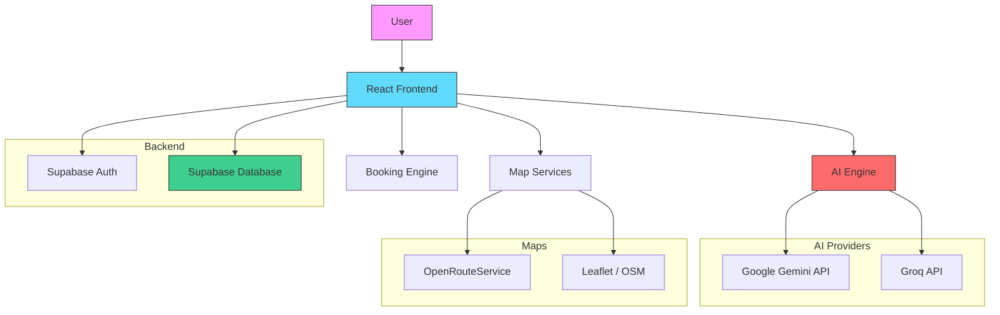

# Roameo : AI-Powered Travel Planner

[](https://react.dev)
[](https://vitejs.dev)
[](https://supabase.com)
[](https://tailwindcss.com)
[](https://www.docker.com)
[](https://project-osrm.org/)
[](https://opensource.org/licenses/MIT)

**Roameo** is an advanced AI-powered travel planning web application that
leverages multiple LLM providers (Google Gemini & Groq) to create personalized,
optimized travel itineraries. Built with React, Supabase, and modern web
technologies, it features smart budgeting, real driving time estimation via
OSRM, overnight travel detection, interactive maps, real-time AI chat, and a
comprehensive booking system.

🌐 **Live Demo**:
[https://roameo-rz80.onrender.com](https://roameo-rz80.onrender.com)

---

## 🌟 Key Features

- **AI-Powered Itinerary Generation** — Create detailed day-by-day schedules
  tailored to your destination, duration, and preferences
- **Multi-LLM Support** — Powered by Google Gemini and Groq (Llama 3, Mixtral)
  for fast, intelligent responses
- **Real Driving Times (OSRM)** — Actual road-based travel duration via Open
  Source Routing Machine, with localStorage caching and auto-geocoding
- **Overnight Travel Detection** — Budget/mid-tier routes 6–16h automatically
  detected as overnight bus/train, eliminating unnecessary travel days
- **Per-Person Budget Planning** — Budget-aware trip plans showing
  per-person/day costs, with solo vs group activity generation
- **Smart Budget Allocation** — Category-wise breakdown (transport,
  accommodation, activities) with per-person derived values
- **Interactive Maps** — Real-time route visualization with Leaflet,
  walking/driving directions via OpenRouteService
- **AI Travel Companion** — Real-time chat with an AI assistant for travel tips,
  cultural insights, and recommendations
- **Destination Discovery** — Explore curated destinations with detailed info,
  weather, and local highlights
- **Hotel & Flight Booking** — Integrated booking system with search,
  comparison, and management
- **PDF Export** — Download beautifully formatted itineraries as PDF documents
- **Dark/Light Mode** — Fully themed UI with smooth transitions
- **Authentication** — Secure auth via Supabase (Email/Password + Google OAuth)
- **Responsive Design** — Optimized for desktop, tablet, and mobile screens

---

## 🏗️ System Architecture

Roameo follows a modern client-side architecture with a Supabase backend and AI
orchestration layer:



### Core Modules

1. **Planning Engine** (`engine/`)
   - **Trip Orchestrator** — Coordinates all planning phases: timeline, budget,
     transport, and AI generation
   - **Trip Duration Planner** — Feasibility check using OSRM real driving times
     with overnight travel detection
   - **Travel Timeline Builder** — Creates structural TRAVEL/EXPLORE day
     segments with overnight arrival metadata
   - **Budget Allocator** — Envelope-based allocation with per-person derived
     values for UI and LLM
   - **Route Time API** (`api/routeTime.js`) — OSRM wrapper with Nominatim
     geocoding fallback and 30-day localStorage cache

2. **AI Engine** (`services/ai/`)
   - Multi-provider LLM orchestration (Gemini + Groq)
   - Prompt engineering with solo/group traveler rules and per-person budget
     constraints
   - Structured JSON parsing of AI responses
   - Fallback logic between providers

3. **Itinerary Generator** (`store/itineraryStore.js`)
   - Creates optimized daily schedules with time slots
   - Handles multi-day trip planning
   - Activity management (add, edit, delete, reorder)

4. **Budget Manager** (`store/budgetStore.js`)
   - Real-time expense tracking per trip (per-person view)
   - Category-wise breakdown (food, transport, accommodation, activities)
   - Multi-currency support with conversion
   - AI-powered budget analysis and recommendations

5. **Booking System** (`store/bookingStore.js`)
   - Hotel and flight search integration
   - Booking management and status tracking
   - Scoring algorithm for optimal recommendations

6. **Transport Engine** (`utils/transportEngine.js`)
   - Distance-tier estimation with smart transport mode selection
   - Overnight bus/train detection for budget-tier long routes
   - Envelope-aware cost calculation with downgrade ladder

7. **Map & Route Engine** (`components/map/`)
   - Interactive Leaflet maps with custom markers
   - Route visualization via OpenRouteService
   - Walking/driving/cycling directions
   - Activity highlight and focus controls

8. **AI Companion** (`components/companion/`)
   - Context-aware travel chat assistant
   - Cultural tips, safety alerts, local recommendations
   - Conversation history management

---

## 🚀 Features

### Core Capabilities

- **Multi-Agent AI System** — Specialized prompts for planning, budgeting, and
  recommendations
- **Natural Language Understanding** — Parse complex travel requests and
  preferences
- **Destination Research** — Discover hidden gems and popular attractions
- **Smart Itinerary Generation** — Create realistic, well-paced daily schedules
- **Budget-Aware Planning** — Plans optimized for Low, Mid, High, or Luxury
  budgets
- **Real-time Map Integration** — Visualize routes with turn-by-turn directions
- **Drag & Drop** — Reorder activities within your itinerary
- **Safety Alerts** — AI-driven warnings for potentially dangerous activities or
  locations
- **Web Share** — Share generated itineraries with friends and family
- **PDF Export** — Download itineraries as beautifully formatted PDF documents

### Supported LLM Providers

| Provider          | Models                       | Use Case                          |
| ----------------- | ---------------------------- | --------------------------------- |
| **Google Gemini** | Gemini 1.5 Flash, Gemini Pro | Primary itinerary generation      |
| **Groq**          | Llama 3 70B, Mixtral 8x7B    | Fast inference, fallback provider |

### Data Flow

```
User Input → AI Engine → Structured Itinerary → Map Rendering
                ↓                    ↓
         Budget Analysis      Supabase Storage
                ↓                    ↓
         Recommendations       Trip Management
```

---

## 🚀 Quick Start

### Prerequisites

- Node.js 18+
- npm (Node Package Manager)
- A [Supabase](https://supabase.com) project (free tier works)
- API keys for [Google Gemini](https://aistudio.google.com/) and/or
  [Groq](https://console.groq.com/)

### Installation

1. **Clone the repository:**
   ```bash
   git clone https://github.com/K007-K/AI-Travel-Assistant.git
   cd AI-Travel-Assistant
   ```

2. **Install dependencies:**
   ```bash
   cd frontend
   npm install
   ```

3. **Set up environment variables:** Create a `.env` file in the `frontend/`
   directory:
   ```env
   # Supabase
   VITE_SUPABASE_URL=your_supabase_project_url
   VITE_SUPABASE_ANON_KEY=your_supabase_anon_key

   # AI Providers
   VITE_GEMINI_API_KEY=your_gemini_api_key
   VITE_GROQ_API_KEY=your_groq_api_key

   # Maps
   VITE_ORS_API_KEY=your_openrouteservice_api_key

   # App Config
   VITE_APP_NAME=Roameo
   VITE_APP_VERSION=1.0.0
   VITE_TRANSLATION_API_URL=https://libretranslate.de
   ```

4. **Set up Supabase:**
   - Create a new project at [supabase.com](https://supabase.com)
   - Run the SQL migrations in `backend/supabase/migrations/` via the SQL Editor
   - Enable Google OAuth (optional) under Authentication → Providers

5. **Start the development server:**
   ```bash
   npm run dev
   ```
   The app will be available at `http://localhost:5173`

---

## 🔧 Configuration

### Environment Variables

| Variable                   | Required | Description                           |
| -------------------------- | -------- | ------------------------------------- |
| `VITE_SUPABASE_URL`        | ✅       | Supabase project URL                  |
| `VITE_SUPABASE_ANON_KEY`   | ✅       | Supabase anonymous key                |
| `VITE_GEMINI_API_KEY`      | ✅       | Google Gemini API key                 |
| `VITE_GROQ_API_KEY`        | ⚡       | Groq API key (fallback AI provider)   |
| `VITE_ORS_API_KEY`         | ⚡       | OpenRouteService key (for map routes) |
| `VITE_TRANSLATION_API_URL` | ❌       | LibreTranslate endpoint               |
| `VITE_APP_NAME`            | ❌       | App display name (default: Roameo)    |

### Supabase Tables

The following tables are required (migrations in
`backend/supabase/migrations/`):

- `profiles` — User profiles and preferences
- `trips` — Trip data with itineraries
- `bookings` — Hotel/flight booking records
- `cost_events` — Budget tracking entries

---

## 🛠️ Tech Stack

<p align="center">
  <a href="https://react.dev"></a>
  <a href="https://vitejs.dev"></a>
  <a href="https://tailwindcss.com"></a>
  <a href="https://developer.mozilla.org/en-US/docs/Web/JavaScript"></a>
  <a href="https://supabase.com"></a>
  <a href="https://www.docker.com"></a>
  <a href="https://leafletjs.com"></a>
  <a href="https://ai.google.dev"></a>
</p>

### Core Dependencies

| Category             | Technology                               |
| -------------------- | ---------------------------------------- |
| **Frontend**         | React 18, Vite 5, Tailwind CSS 3         |
| **State Management** | Zustand                                  |
| **Backend / Auth**   | Supabase (PostgreSQL, Auth, RLS)         |
| **AI / LLM**         | Google Gemini API, Groq SDK              |
| **Maps**             | Leaflet, React-Leaflet, OpenRouteService |
| **Animations**       | Framer Motion                            |
| **Icons**            | Lucide React                             |
| **PDF Export**       | jsPDF                                    |
| **Deployment**       | Docker, Nginx, Render                    |

---

## 🗂 Project Structure

```
AI-Travel-Assistant/
├── frontend/                    # React client application
│   ├── src/
│   │   ├── api/                 # External API wrappers
│   │   │   ├── routeTime.js     # OSRM driving times + geocoding + cache
│   │   │   ├── geocode.js       # Geocoding API
│   │   │   ├── places.js        # Places/destinations API
│   │   │   └── weather.js       # Weather data API
│   │   ├── engine/              # Core planning engine
│   │   │   ├── tripOrchestrator.js     # Main orchestration pipeline
│   │   │   ├── tripDurationPlanner.js  # Feasibility + overnight detection
│   │   │   ├── travelTimelineBuilder.js # TRAVEL/EXPLORE day segmentation
│   │   │   ├── budgetAllocator.js      # Envelope-based budget allocation
│   │   │   └── feasibilityGuard.js     # Input validation
│   │   ├── components/
│   │   │   ├── ai/              # AI chat components
│   │   │   ├── companion/       # AI travel companion
│   │   │   ├── features/        # Feature-specific components
│   │   │   ├── home/            # Landing page & dashboard
│   │   │   ├── layout/          # Navbar, footer, protected routes
│   │   │   ├── map/             # Map, markers, route layers
│   │   │   └── ui/              # Reusable UI components
│   │   ├── hooks/               # Custom React hooks
│   │   ├── lib/                 # Supabase client setup
│   │   ├── pages/               # Route-level page components
│   │   ├── services/
│   │   │   └── ai/              # AI service layer (Gemini, Groq)
│   │   ├── store/               # Zustand state stores
│   │   ├── utils/               # Utility functions
│   │   │   └── transportEngine.js # Distance + transport mode + overnight
│   │   └── App.jsx              # Root component & routing
│   ├── tests/                   # Vitest unit tests (160+ tests)
│   ├── public/                  # Static assets
│   ├── Dockerfile               # Multi-stage Docker build
│   ├── nginx.conf.template      # Nginx SPA configuration
│   └── package.json             # Dependencies & scripts
├── backend/
│   └── supabase/
│       ├── functions/           # Edge functions
│       │   └── itinerary-generator/  # LLM prompt engineering
│       └── migrations/          # SQL migration files
├── render.yaml                  # Render deployment config
├── docker-compose.yml           # Local container orchestration
└── README.md                    # This file
```

---

## 🚀 Deployment

### Local Development

```bash
cd frontend
npm install
npm run dev
```

### Docker (Local)

```bash
docker-compose up --build
```

Access the app at `http://localhost:3000`

### Production (Render)

The app is deployed on [Render](https://render.com) using Docker:

1. Connect your GitHub repository to Render
2. Set the environment variables in the Render dashboard
3. Deploy — Render will build the Docker image and serve via Nginx

**Live URL**:
[https://roameo-rz80.onrender.com](https://roameo-rz80.onrender.com)

---

## 🧪 Testing

### Automated Tests

```bash
cd frontend && npx vitest run    # 160+ tests across 10 files
```

### Demo Credentials

To explore the app without signing up:

```
Email: demo@roameo.com
Password: demo1234
```

### Test Scenarios

1. **Create a Trip** — Go to My Trips → Create Vizag → Tirupati, 1 day, budget,
   2 people
2. **Duration Check** — Observe overnight travel detection (0 travel days for
   9.4h route)
3. **Generate Itinerary** — AI generates group activities with per-person costs
4. **Budget Planning** — Set per-person budget, see group total in financial
   summary
5. **Discover** — Browse curated destinations on the Discover page
6. **AI Chat** — Ask the AI companion for travel recommendations
7. **Bookings** — Search and compare hotels for your destination

---

## 🤝 Contributing

We welcome contributions! Here's how you can help:

1. 🍴 Fork the repository
2. 🌿 Create a feature branch (`git checkout -b feature/amazing-feature`)
3. 💾 Commit your changes (`git commit -m 'Add some amazing feature'`)
4. 🔄 Push to the branch (`git push origin feature/amazing-feature`)
5. ✨ Open a Pull Request

### Development Setup

```bash
git clone https://github.com/K007-K/AI-Travel-Assistant.git
cd AI-Travel-Assistant/frontend
npm install
npm run dev
```

---

## 📄 License

This project is licensed under the MIT License - see the [LICENSE](LICENSE) file
for details.

## 🙏 Acknowledgments

- [React](https://react.dev) — UI framework
- [Supabase](https://supabase.com) — Backend, auth, and database
- [Google Gemini](https://ai.google.dev/) — Primary AI provider
- [Groq](https://groq.com/) — High-performance LLM inference
- [Leaflet](https://leafletjs.com/) — Interactive maps
- [OpenRouteService](https://openrouteservice.org/) — Routing and directions
- [Tailwind CSS](https://tailwindcss.com) — Utility-first CSS
- [Framer Motion](https://www.framer.com/motion/) — Animations
- [Render](https://render.com) — Cloud deployment

---

<div align="center">
Made with ❤️ by <a href="https://github.com/K007-K">K Karthik</a>
</div>
